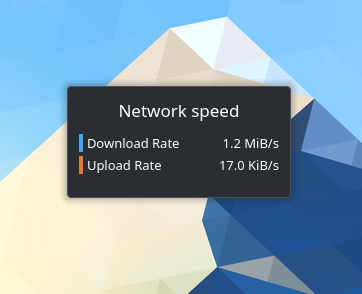

# KDE Plasma Network Speed Widget
This is a clone of the default **Network Speed** widget that comes installed with **KDE Plasma Version 5.22.3**

This repository is for adding and testing modifications to the widget, such as adding the ability to show Download / Upload rates in bits (b/s, Kib/s and Mib/s).

Currently, the widget only shows rates in bytes (B/s, KiB/s and MiB/s).

---

## Version History
### v1.0
Notes: Cloned from the original extension that came with the OS Install and KDE Plasma v5.22.3
### v1.1 (in development)
For the file named `metadata.desktop`, I am following the instructions found at:
[https://forum.kde.org/viewtopic.php?f=289&t=151414#p395823](https://forum.kde.org/viewtopic.php?f=289&t=151414#p395823)

For the file named `net.qml`, I am following the instructions available at:  
[https://forum.kde.org/viewtopic.php?f=304&t=138731#p371513](https://forum.kde.org/viewtopic.php?f=304&t=138731#p371513)  
and  
[https://github.com/vjr/plasma-workspace/commit/ac98538f903be7c11d093323e67fd0314e6b7c95](https://github.com/vjr/plasma-workspace/commit/ac98538f903be7c11d093323e67fd0314e6b7c95)

Once these edits have been implemented, running  
`plasmawindowed WIDGET_FOLDER_NAME`  
from the Terminal yields errors.